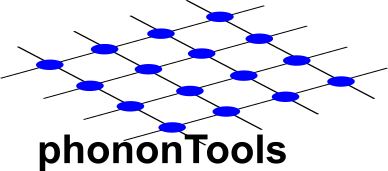

# PhononTools


## Description

Python program to analyze the results generated by [phonopy](https://github.com/phonopy/phonopy). Using the .yaml and .dat files that phonopy generates one can plot the phonon dispersion, density of states, and analyze the normal modes. All from the command line. This source code can be installed using ``pip``.


## Functionality

### Dispersions ω(q)
Phonon dispersions can be plotted along the high-symmetry path provided in the configuration file used for phonopy. In addition to the dispersion, one can also graph the in-plane out-of-plane norm of the eigenvector corresponding to each eigenvalue. This provides a kind of "fatband" representation for the phonon spectrum

### Density of states ρ(ε)
Atom resolved density of states are plotted by providing the dos dat file generated by phonopy.

### Eigenvectors & Irrep.
Both the eigenvectors and irreducible representations can be parsed and sorted.


## Help
All arguments are passed from the command line. For help, simply type

```
phononTools --help
```
to generate an outline and corresponding description of the kinds of commands that can be run. 

## Tips
- The density of states and dispersion can be plotted next to each other by providing both the band file and dos file.
- Available units are meV, cm-1, and THz.
